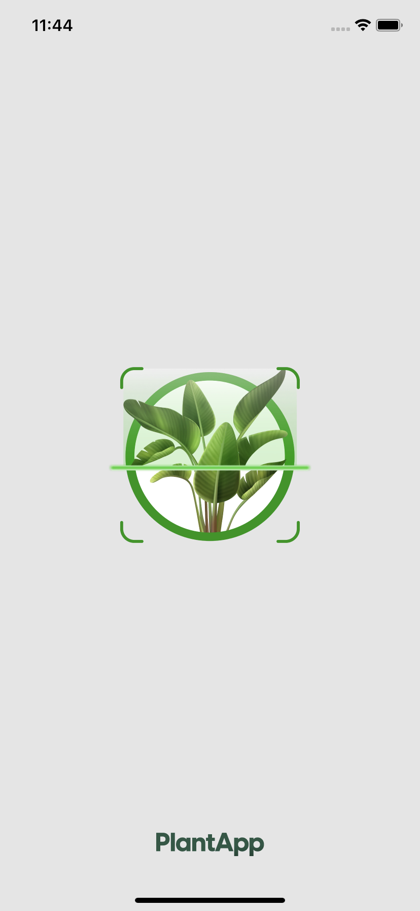
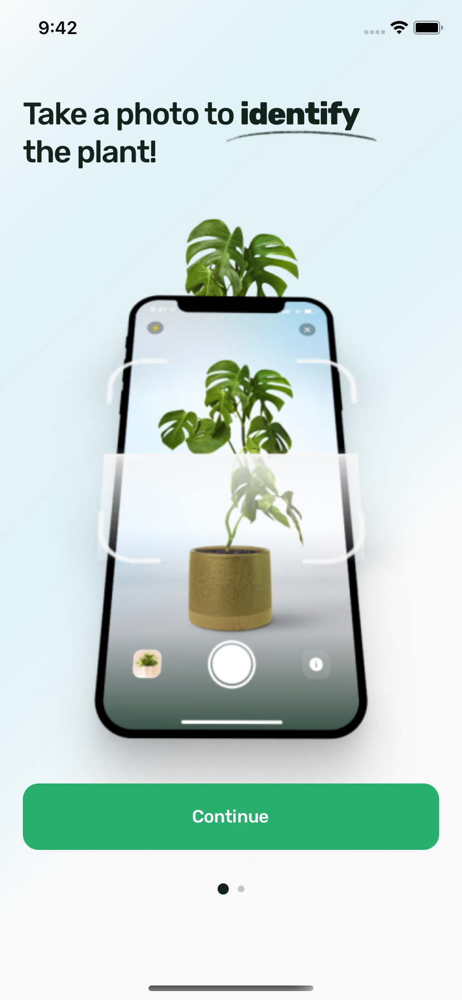
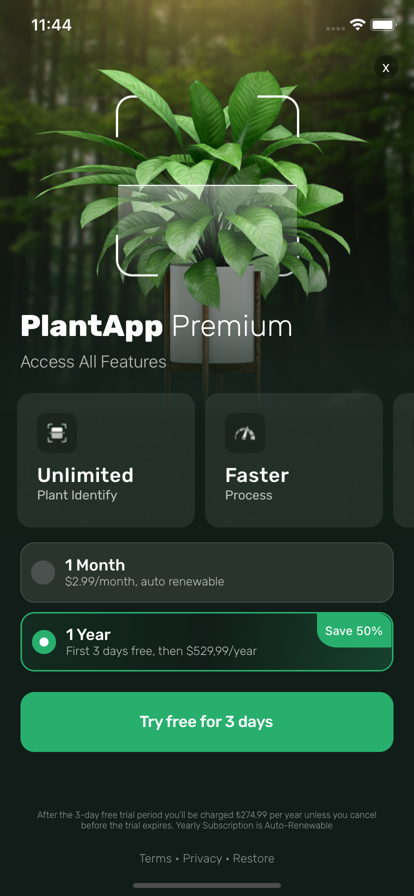
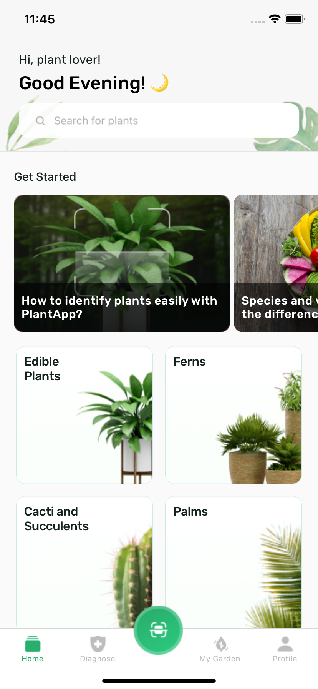

# PlantApp!
    


## Tools

* Redux
* react-native-async-storage/async-storage
* React Navigation
* react-native-splash-screen
* react-native-linear-gradient


```
npx react-native run-ios

```
